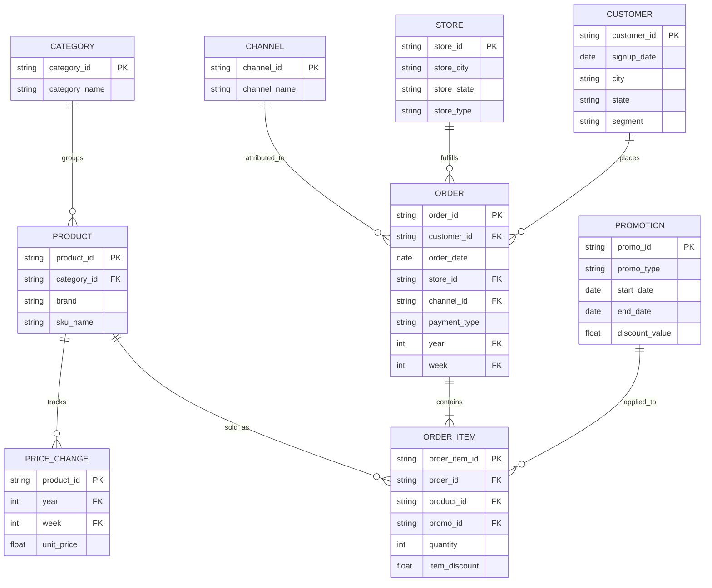
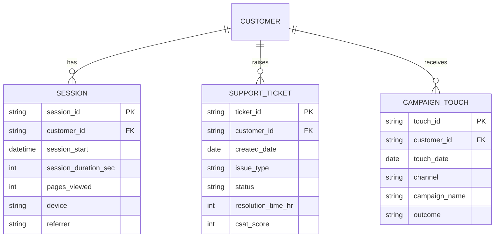
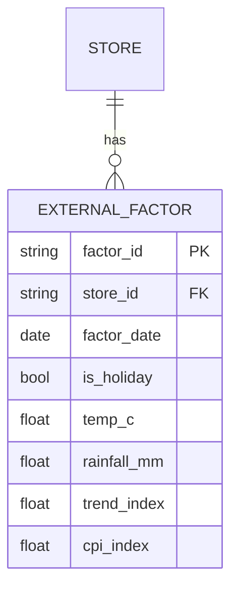

### Core 

```mermaid
erDiagram
  CUSTOMER ||--o{ ORDER : places
  ORDER ||--|{ ORDER_ITEM : contains
  PRODUCT ||--o{ ORDER_ITEM : sold_as
  CATEGORY ||--o{ PRODUCT : groups
  STORE ||--o{ ORDER : fulfills
  CHANNEL ||--o{ ORDER : attributed_to
  PROMOTION ||--o{ ORDER_ITEM : applied_to
  PRODUCT ||--o{ PRICE_CHANGE : tracks
  
  CUSTOMER {
    string customer_id PK
    date signup_date
    string city
    string state
    string segment
  }

  ORDER {
    string order_id PK
    string customer_id FK
    date order_date
    string store_id FK
    string channel_id FK
    string payment_type
    int year FK
	int week FK
  }

  ORDER_ITEM {
    string order_item_id PK
    string order_id FK
    string product_id FK
    string promo_id FK
    int quantity
    float item_discount
  }

  PRODUCT {
    string product_id PK
    string category_id FK
    string brand
    string sku_name
  }
  PRICE_CHANGE {
    string product_id PK
	int year FK
	int week FK
    float unit_price
  }
  
  CATEGORY {
    string category_id PK
    string category_name
  }

  STORE {
    string store_id PK
    string store_city
    string store_state
    string store_type
  }

  CHANNEL {
    string channel_id PK
    string channel_name   
  }

  PROMOTION {
    string promo_id PK
    string promo_type    
    date start_date
    date end_date
    float discount_value
  }
```

```mermaid
erDiagram
  CUSTOMER ||--o{ SESSION : has
  CUSTOMER ||--o{ SUPPORT_TICKET : raises
  CUSTOMER ||--o{ CAMPAIGN_TOUCH : receives

  SESSION {
    string session_id PK
    string customer_id FK
    datetime session_start
    int session_duration_sec
    int pages_viewed
    string device
    string referrer
  }

  SUPPORT_TICKET {
    string ticket_id PK
    string customer_id FK
    date created_date
    string issue_type
    string status
    int resolution_time_hr
    int csat_score
  }

  CAMPAIGN_TOUCH {
    string touch_id PK
    string customer_id FK
    date touch_date
    string channel      
    string campaign_name
    string outcome    
  }
```

```mermaid
erDiagram
  STORE ||--o{ EXTERNAL_FACTOR : has
  EXTERNAL_FACTOR {
    string factor_id PK
    string store_id FK
    date factor_date
    bool is_holiday
    float temp_c
    float rainfall_mm
    float trend_index
    float cpi_index
  }
```

